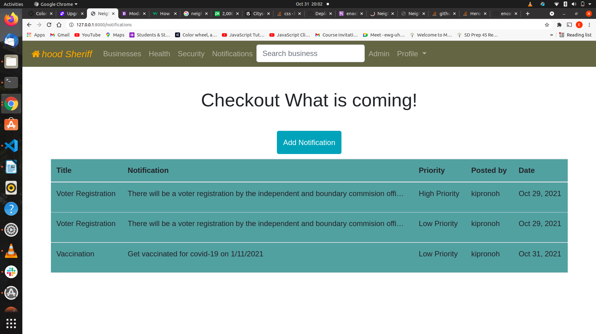

# Project Title
HoodSheriff

# Author
> [Enock Kipronoh](https://github.com/encok "encok")


## Link to Live Site 
> https://github.com/encok/Hood


## Description
This is an application that allows users in an area to interact with other people who also live in the same area. Users can post businesses and can view other businesses in the area. Users can also find the contacts for the local security including police and health centres.

## Behavior Driven Development

## Screenshots
<br/>



 
## Installation Requirements
Clone this repository and navigate to the folder.
Run the following commands to allow functionality of the app:-

* sudo apt-get install python3.8
* sudo apt-get install python3-pip
* sudo apt-get install python3.8-env
* python3.8 -m env virtual
* source env/bin/activate
* pip install -r requirements.txt
## Tests
Run the following command for tests<br>
* $ python manage.py test neighbourhood


## Technologies Used
---
```
* Python 3.8
* HTML5, CSS and Bootstrap4
* jdango3.2.4 Framework
* Postgressql
* Heroku
```
---
## Known Bugs
No known bugs so far

## Support Details
Contact me for further help<br/> 
email: enckkipronoh@gmail.com<br/>

## License
This is the link to the MIT license used<br/><br/>
> License link<br/>
https://github.com/encok/Hood/blob/master/LICENSE
